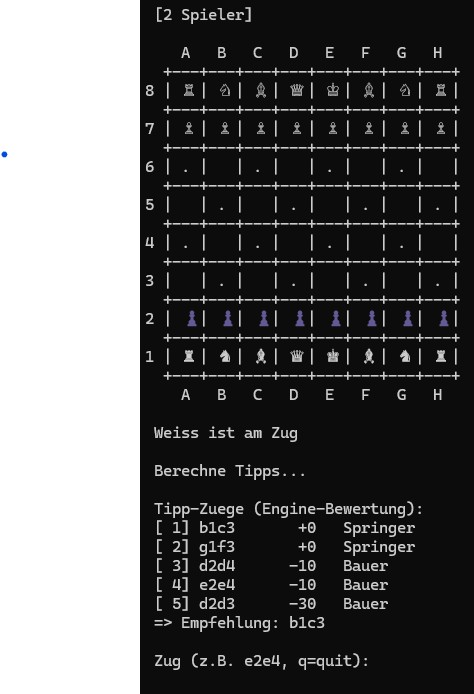

# ChatAndChess

Play chess against your personal AI -- or with a friend. Text-based terminal game with multiple opponent modes.

## Screenshot



## Features

- **4 Game Modes:**
  - **2 Player** -- Local hotseat, play with a friend on the same machine
  - **vs Bot** -- Minimax engine with configurable search depth (1-5)
  - **vs Claude API** -- Play against Claude AI via Anthropic API
  - **vs Claude Code** -- File-based communication for Claude Code integration
- **Full chess rules** -- Castling, en passant, pawn promotion, check/checkmate/stalemate detection
- **Piece-square tables** -- Positional evaluation for smarter bot play
- **Alpha-beta pruning** -- Efficient search with move ordering
- **Tactics Analyzer** -- Standalone tool for position analysis and move evaluation
- **Configurable hint modes:**
  - Gleichzug-Modus (both players see engine hints)
  - Engine-Modus (only AI sees hints)
  - Training-Modus (only human sees hints)
  - Mensch-Modus (no hints for anyone)

## Requirements

- Python 3.10+
- No external dependencies for base game
- Optional: `anthropic` package for Claude API mode

```bash
# Optional Claude API mode dependency
pip install -r requirements.txt
```

## Quick Start

```bash
# Start the game
python chess.py

# Or use the launcher (Windows)
START_CHESS.bat

# Start in worker mode (for Claude Code integration)
python chess.py --worker
```

## How to Play

Enter moves in UCI notation: `e2e4` (from-square to-square).

Special commands during play:
- Type a move like `e2e4`, `g1f3`, `e1g1` (castling)
- Pawn promotion: move to last rank and you will be prompted

## Tactics Analyzer

```bash
# Analyze current position
python chess_analyze.py

# Analyze with custom depth
python chess_analyze.py --depth 4

# Analyze a sequence of moves
python chess_analyze.py e2e4 e7e5 g1f3

# Show more candidate moves
python chess_analyze.py --top 8
```

## Datenschutz / Privacy

ChatAndChess keeps local runtime files out of Git. API keys belong in the
`ANTHROPIC_API_KEY` environment variable or a local home-directory key file,
never in this repository.

The following local files are ignored:

- `.env`, `.env.*`, `.anthropic_key`, credential and token files
- `chess_settings.json`
- `CLAUDE_PROMPT.txt`
- `chess_comm/`
- build outputs such as `build/`, `dist/`, `*.exe`, `*.msi`, and `*.msix`

## Project Structure

```
chess.py              Main game (all modes, engine, rules)
chess_analyze.py      Tactics analyzer (position evaluation, candidate moves)
START_CHESS.bat       Windows launcher
build_exe.bat         Optional PyInstaller build helper for Windows
requirements.txt      Base/optional dependency notes
chess_comm/           Runtime communication directory (gitignored)
chess_settings.json   Local game settings (gitignored)
```

## License

[MIT](LICENSE)

## Community Docs

- [Contributing](CONTRIBUTING.md)
- [Code of Conduct](CODE_OF_CONDUCT.md)
- [Security Policy](SECURITY.md)
- [Changelog](CHANGELOG.md)

---

## English Summary

ChatAndChess is a terminal-based chess game written in Python. Play against a friend locally, challenge a built-in Minimax bot, or face Claude AI through the Anthropic API or Claude Code file-based integration. Features full chess rules, positional evaluation, and a standalone tactics analyzer.

---

## Haftung / Liability

Dieses Projekt ist eine **unentgeltliche Open-Source-Schenkung** im Sinne der §§ 516 ff. BGB. Die Haftung des Urhebers ist gemäß **§ 521 BGB** auf **Vorsatz und grobe Fahrlässigkeit** beschränkt. Ergänzend gelten die Haftungsausschlüsse aus MIT.

Nutzung auf eigenes Risiko. Keine Wartungszusage, keine Verfügbarkeitsgarantie, keine Gewähr für Fehlerfreiheit oder Eignung für einen bestimmten Zweck.

This project is an unpaid open-source donation. Liability is limited to intent and gross negligence (§ 521 German Civil Code). Use at your own risk. No warranty, no maintenance guarantee, no fitness-for-purpose assumed.

