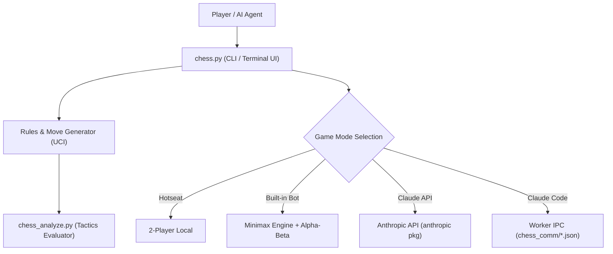

# ChatAndChess

[](https://github.com/entertain-and-more/ChatAndChess/actions/workflows/tests.yml)
[](https://www.python.org/)
[](https://opensource.org/licenses/MIT)
[](llms.txt)

[English](README.md) | [Deutsch](README_de.md)

Terminal chess for local games, a built-in Minimax bot, Claude API mode, and Claude Code worker integration.
Terminal-Schach für lokale Partien, Minimax-Bot, Claude API und Claude-Code-Integration.

| Feature | Description |
| --- | --- |
| **Core Engine** | Pure Python 3.10+ implementation with zero required external dependencies |
| **Game Modes** | Hotseat (2P), Minimax Bot (depth 1–5), Claude API, Claude Code Worker IPC |
| **Rules Engine** | Castling, En Passant, Pawn Promotion, Check, Checkmate, and Stalemate |
| **Tactics Analyzer** | Position evaluator & candidate move ranker (`chess_analyze.py`) |
| **Worker Mode** | Date/JSON-based subprocess interface for AI agents (`python chess.py --worker`) |

> [!NOTE]
> **AI & LLM Integration**: ChatAndChess includes a specialized file-based `--worker` IPC mode designed for AI agents like Claude Code to play chess as background sub-processes without losing legal move context (such as castling rights & en-passant state). Machine-readable context is available in [llms.txt](llms.txt).

## Screenshots


## Architecture & Dataflow



## Features / Funktionen

- **4 Game Modes / 4 Spielmodi**
  - **2 Player**: Local hotseat game on one machine / Lokales Hotseat-Spiel auf einem Rechner
  - **vs Bot**: Minimax engine with configurable search depth (1–5) / Minimax-Engine mit einstellbarer Suchtiefe (1–5)
  - **vs Claude API**: Optional game against Claude via Anthropic API / Optionales Spiel gegen Claude über die Anthropic API
  - **vs Claude Code**: File-based worker communication for Claude Code including stable castling and en-passant state / Dateibasierte Worker-Kommunikation für Claude Code inklusive stabiler Rochade- und En-passant-Zustände im Worker-JSON
- **Full Chess Rules / Vollständige Schachregeln**
  - Castling, en passant, pawn promotion, check, checkmate, and stalemate / Rochade, en passant, Bauernumwandlung, Schach, Matt und Patt
- **Engine Hints / Engine-Hilfen**
  - Equal hints (both sides), Engine mode (AI only), Training mode (human only), or Off (human mode)
- **Tactics & Position Analysis / Taktik & Analyse**
  - Piece-square tables, Alpha-Beta pruning, and standalone tactics analyzer (`chess_analyze.py`)

## Requirements / Voraussetzungen

- Python 3.10+
- Zero external dependencies for base terminal game
- Optional: `anthropic` package for Claude API mode (`pip install -r requirements.txt`)

```bash
pip install -r requirements.txt
```

## Quick Start / Start

```bash
# Start game / Spiel starten
python chess.py

# Windows launcher
START_CHESS.bat

# Worker mode for Claude Code
python chess.py --worker
```

## How to Play / Spielweise

Moves use standard UCI notation: `e2e4` (from-square to-square).

- Normal moves: `e2e4`, `g1f3`
- Castling: `e1g1` (short) or `e1c1` (long)
- Pawn promotion: Prompted automatically when reaching the back rank

## Tactics Analyzer / Taktik-Analyzer

> [!TIP]
> Use `chess_analyze.py` to evaluate arbitrary positions, compare top candidate moves, or verify move sequences offline.

```bash
# Analyze current position
python chess_analyze.py

# Custom search depth
python chess_analyze.py --depth 4

# Analyze move sequence
python chess_analyze.py e2e4 e7e5 g1f3

# Show top 8 candidate moves
python chess_analyze.py --top 8
```

## Tests

```bash
python -m unittest discover -s tests -p "test_*.py"
python -m py_compile chess.py chess_analyze.py
python tests/source_platform_smoke.py
```

## Privacy & Security / Datenschutz

ChatAndChess keeps runtime data local. API keys belong in the `ANTHROPIC_API_KEY` environment variable or a local key file, never in this repository.

Ignored local files:
- `.env`, `.env.*`, `.anthropic_key`, credentials & tokens
- `chess_settings.json`
- `CLAUDE_PROMPT.txt`
- `chess_comm/`
- `AUFGABEN.txt`, `TEST.txt`, `TESTS.txt`, `TESTERGEBNISSE.txt`
- Build outputs (`build/`, `dist/`, `*.exe`, `*.msi`, `*.msix`)
- Local database/cache outputs (`*.db`, `*.sqlite*`, `.pytest_cache/`, `htmlcov/`)

## Project Structure / Projektstruktur

```
chess.py              Main game (all modes, engine, rules, worker interface)
chess_analyze.py      Tactics analyzer (position evaluation, candidate moves)
pyproject.toml        PEP 621 package & test metadata
START_CHESS.bat       Windows launcher
build_exe.bat         Optional PyInstaller build helper for Windows
requirements.txt      Base / optional dependency notes
tests/source_platform_smoke.py
                      Platform smoke for menu quit, worker boot, and analyzer (Linux + macOS)
README/screenshots/   Repository screenshots used by the README
chess_comm/           Runtime communication directory (gitignored)
chess_settings.json   Local game settings (gitignored)
```

## Community Docs

- [Contributing](CONTRIBUTING.md)
- [Code of Conduct](CODE_OF_CONDUCT.md)
- [Security Policy](SECURITY.md)
- [Changelog](CHANGELOG.md)
- [LLM context](llms.txt)

## License

[MIT](LICENSE)

---

## English Summary

ChatAndChess is a terminal-based chess game written in Python. Play against a friend locally, challenge a built-in Minimax bot, or face Claude AI through the Anthropic API or Claude Code file-based integration. Features full chess rules, positional evaluation, and a standalone tactics analyzer.

---

## Haftung / Liability

Dieses Projekt ist eine **unentgeltliche Open-Source-Schenkung** im Sinne der §§ 516 ff. BGB. Die Haftung des Urhebers ist gemäß **§ 521 BGB** auf **Vorsatz und grobe Fahrlässigkeit** beschränkt. Ergänzend gelten die Haftungsausschlüsse aus MIT.

Nutzung auf eigenes Risiko. Keine Wartungszusage, keine Verfügbarkeitsgarantie, keine Gewähr für Fehlerfreiheit oder Eignung für einen bestimmten Zweck.

This project is an unpaid open-source donation. Liability is limited to intent and gross negligence (§ 521 German Civil Code). Use at your own risk. No warranty, no maintenance guarantee, no fitness-for-purpose assumed.
