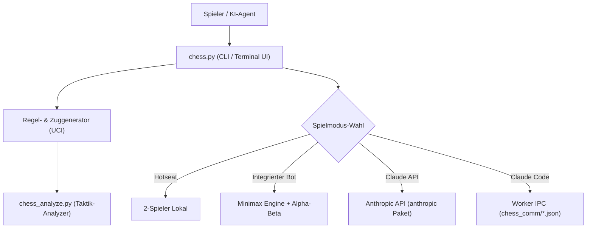

# ChatAndChess (Deutsch)

[](https://github.com/entertain-and-more/ChatAndChess/actions/workflows/tests.yml)
[](https://www.python.org/)
[](https://opensource.org/licenses/MIT)
[](llms.txt)

[English](README.md) | [Deutsch](README_de.md)

Terminal-Schach in Python für lokale Partien, Minimax-Bot, Claude API und Claude-Code-Integration.

| Funktion | Beschreibung |
| --- | --- |
| **Kern-Engine** | Reine Python 3.10+ Implementierung ohne zwingende externe Abhängigkeiten |
| **Spielmodi** | Hotseat (2-Spieler), Minimax-Bot (Tiefe 1–5), Claude API, Claude Code Worker IPC |
| **Regel-Engine** | Rochade, En Passant, Bauernumwandlung, Schach, Matt und Patt |
| **Taktik-Analyzer** | Stellungsbewertung & Kandidatenzug-Ranking (`chess_analyze.py`) |
| **Worker-Modus** | Dateibasierte Subprozess-Schnittstelle für KI-Agenten (`python chess.py --worker`) |

> [!NOTE]
> **KI- & LLM-Integration**: ChatAndChess enthält einen spezialisierten `--worker`-IPC-Modus, mit dem KI-Agenten wie Claude Code als Hintergrundprozess Schach spielen können, ohne legale Zug-Kontexte (wie Rochaderechte & En-Passant-Status) zu verlieren. Maschinenlesbare Spezifikationen sind in [llms.txt](llms.txt) hinterlegt.

## Screenshots


## Architektur & Datenfluss



## Funktionen

- **4 Spielmodi**
  - **2 Player**: Lokales Hotseat-Spiel auf einem Rechner
  - **vs Bot**: Minimax-Engine mit einstellbarer Suchtiefe (1–5)
  - **vs Claude API**: Optionales Spiel gegen Claude über die Anthropic API
  - **vs Claude Code**: Dateibasierte Worker-Kommunikation für Claude Code inklusive stabiler Rochade- und En-passant-Zustände im Worker-JSON
- **Vollständige Schachregeln**
  - Rochade (kurz/lang), en passant, Bauernumwandlung, Schach, Matt und Patt
- **Engine-Hilfen**
  - Gleichzug-Modus (beide Seiten sehen Hinweise), Engine-Modus (nur KI), Training-Modus (nur Mensch), Mensch-Modus (keine Hinweise)
- **Taktik & Stellungsanalyse**
  - Piece-Square-Tabellen, Alpha-Beta-Pruning und eigenständiger Taktik-Analyzer (`chess_analyze.py`)

## Voraussetzungen

- Python 3.10+
- Keine externen Abhängigkeiten für das Basis-Terminalspiel
- Optional: Paket `anthropic` für den Claude-API-Modus (`pip install -r requirements.txt`)

```bash
pip install -r requirements.txt
```

## Schnellstart

```bash
# Spiel starten
python chess.py

# Windows-Starter
START_CHESS.bat

# Worker-Modus für Claude Code
python chess.py --worker
```

## Spielweise

Züge werden in standardisierter UCI-Notation eingegeben: `e2e4` (Startfeld zu Zielfeld).

- Normale Züge: `e2e4`, `g1f3`
- Rochade: `e1g1` (kurz) oder `e1c1` (lang)
- Bauernumwandlung: Beim Erreichen der letzten Reihe fragt das Programm nach der Figur.

## Taktik-Analyzer

> [!TIP]
> Verwende `chess_analyze.py`, um beliebige Positionen zu bewerten, Top-Kandidatenzüge zu vergleichen oder Zugfolgen offline zu verifizieren.

```bash
# Aktuelle Position analysieren
python chess_analyze.py

# Eigene Suchtiefe
python chess_analyze.py --depth 4

# Zugfolge analysieren
python chess_analyze.py e2e4 e7e5 g1f3

# Mehr Kandidatenzüge anzeigen
python chess_analyze.py --top 8
```

## Tests

```bash
python -m unittest discover -s tests -p "test_*.py"
python -m py_compile chess.py chess_analyze.py
python tests/source_platform_smoke.py
```

## Datenschutz & Sicherheit

ChatAndChess speichert Spiel- und Worker-Laufzeitdaten lokal. API-Schlüssel gehören in die Umgebungsvariable `ANTHROPIC_API_KEY` oder in eine lokale Key-Datei, aber nicht in dieses Repository.

Ignorierte lokale Dateien:
- `.env`, `.env.*`, `.anthropic_key`, Credential- & Token-Dateien
- `chess_settings.json`
- `CLAUDE_PROMPT.txt`
- `chess_comm/`
- `AUFGABEN.txt`, `TEST.txt`, `TESTS.txt`, `TESTERGEBNISSE.txt`
- Build-Outputs (`build/`, `dist/`, `*.exe`, `*.msi`, `*.msix`)
- Lokale Datenbank- & Cache-Dateien (`*.db`, `*.sqlite*`, `.pytest_cache/`, `htmlcov/`)

## Projektstruktur

```
chess.py              Hauptspiel (alle Modi, Engine, Regeln, Worker-Interface)
chess_analyze.py      Taktik-Analyzer (Stellungsbewertung, Kandidatenzüge)
pyproject.toml        PEP 621 Paket- & Test-Metadaten
START_CHESS.bat       Windows-Starter
build_exe.bat         Optionaler PyInstaller-Build-Helfer für Windows
requirements.txt      Basis / optionale Abhängigkeiten
tests/source_platform_smoke.py
                      Plattform-Smoke-Test (Linux + macOS)
README/screenshots/   Repository-Screenshots für die Dokumentation
chess_comm/           Laufzeit-Kommunikationsverzeichnis (gitignored)
chess_settings.json   Lokale Spieleinstellungen (gitignored)
```

## Community-Dokumentation

- [Mitwirken](CONTRIBUTING.md)
- [Verhaltenskodex](CODE_OF_CONDUCT.md)
- [Sicherheitsrichtlinie](SECURITY.md)
- [Änderungsprotokoll](CHANGELOG.md)
- [LLM-Kontext](llms.txt)

## Lizenz

[MIT](LICENSE)

---

## Haftungsausschluss

Dieses Projekt ist eine **unentgeltliche Open-Source-Schenkung** im Sinne der §§ 516 ff. BGB. Die Haftung des Urhebers ist gemäß **§ 521 BGB** auf **Vorsatz und grobe Fahrlässigkeit** beschränkt. Ergänzend gelten die Haftungsausschlüsse aus MIT.

Nutzung auf eigenes Risiko. Keine Wartungszusage, keine Verfügbarkeitsgarantie, keine Gewähr für Fehlerfreiheit oder Eignung für einen bestimmten Zweck.
